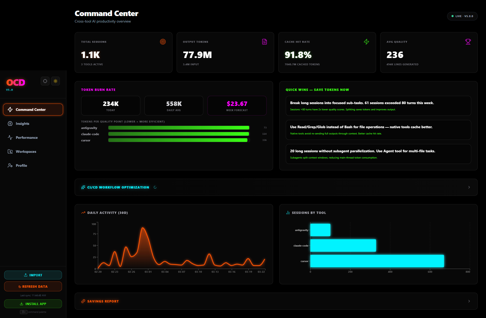
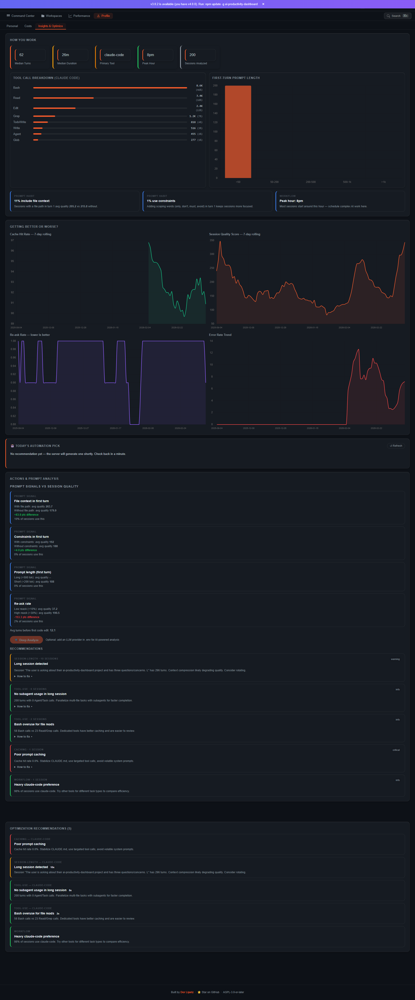

# OCD - Omni Coder Dashboard v5.0

> An AI memory engine that learns from your coding sessions, recommends the right tool for every task, and injects proven solutions into your workflow — all local, no API keys required.

[](https://nodejs.org)
[](LICENSE)
[](#what-gets-tracked)
[](#mcp-setup-30-seconds-no-api-key)
[](docker-compose.yml)
[](https://www.npmjs.com/package/ocd)

---

## Screenshots

> The dashboard UI includes four pillars: Command Center, Performance, Workspaces, and Profile.

<p align="center">
  
</p>

<details>
<summary><strong>More screenshots</strong> (click to expand)</summary>

<p align="center">
  
</p>

</details>

---

## What it actively does for you

This is not a passive analytics dashboard. It's a system that makes you faster:

**Semantic Memory** — When Claude Code solves a complex migration in 15 turns, the system vectorizes the solution, the context, and the error logs. Two weeks later, when you hit a similar error in Cursor, the MCP server bypasses the LLM's knowledge cutoff and injects the exact, locally-proven solution into your prompt context. It's a self-building brain across all your AI tools.

**Routing Recommendations** — "For postgres migrations, use Claude Code + claude-sonnet-4-6 (resolves in 4 turns, 87% win rate). Cursor + gpt-4o takes 11 turns." Based on your actual session history, not benchmarks.

**Real-time Coaching** — SSE-pushed nudges every 60 seconds: alerts when sessions run too long, cache hit rate drops, error spikes occur, or you're idle. Dismissible, actionable, and based on your patterns.

**Prompt Optimization** — Extracts high-quality prompt patterns from your best sessions (quality > 75), grouped by task type. Shows you what works and what doesn't.

**Savings Report** — Concrete metrics on what the system saves you: cache hit savings ($), turns saved vs baseline, time estimates. Toggle between relative metrics and dollar estimates.

---

## MCP Setup (30 seconds, no API key)

The dashboard exposes an MCP server with 11 tools that any AI agent can call mid-session. Zero API keys needed.

```bash
# Auto-setup for all detected MCP clients
npx ocd --setup-mcp

# Or add to a specific project
npx ocd --setup-mcp --project
```

This writes the correct config to Claude Code, Cursor, and Windsurf automatically. Or manually add to your `.mcp.json`:

```json
{
  "mcpServers": {
    "ai-brain": {
      "command": "npx",
      "args": ["ocd", "--mcp"]
    }
  }
}
```

**Available MCP tools:**

| Tool | What it does |
|------|-------------|
| `get_similar_solutions` | **Find proven solutions** from past sessions matching your current error or task context |
| `get_knowledge_context` | **Inject relevant context** — returns the knowledge graph neighborhood for your current work |
| `get_last_session_context` | Pick up where a different tool left off |
| `get_routing_recommendation` | Which tool + model to use for this task |
| `get_efficiency_snapshot` | Cache hit rate, first-attempt %, error recovery |
| `get_active_recommendations` | Open optimization nudges |
| `get_project_stats` | Token/session/model breakdown for a project |
| `get_model_comparison` | claude-sonnet vs gpt-4o vs gemini on your actual sessions |
| `push_handoff_note` | Save a note before switching tools |
| `get_optimal_prompt_structure` | Prompt patterns from your highest-quality sessions |
| `get_topic_summary` | Executive summary of work on a topic within a project |

---

## Import online sessions

Not everything lives in local files. Import sessions from web-based AI tools:

**Bookmarklet** — One-click capture from ChatGPT, Claude.ai, or Gemini. Visit `http://localhost:3030/api/bookmarklet` for setup instructions.

**API Upload** — `POST /api/sessions/upload` accepts JSON arrays of session data for bulk import.

**Webhook** — Push session data from CI/CD or automation:
```bash
curl -X POST http://localhost:3030/api/webhook/session \
  -H "Content-Type: application/json" \
  -d '{"tool":"chatgpt","title":"Debug API","turns":[{"role":"user","content":"..."}]}'
```

**API** — `POST /api/sessions/import` accepts the [import schema](http://localhost:3030/api/sessions/import/schema).

---

## Quick start

```bash
# No install — just run (zero config)
npx ocd

# Or install globally
npm install -g ocd
ocd

# Clone and run (development)
git clone https://github.com/Riko5652/OCD
cd OCD
pnpm install
pnpm run build
pnpm run start

# Docker
docker compose up

# GitHub Codespaces — one-click dev environment
# Click "Code" → "Codespaces" → "Create codespace on main"
```

Open **http://localhost:3030**. The terminal shows a discovery report: which tools were found, which weren't, and exact paths for anything missing.

**Zero config required.** All tool data paths are auto-detected. See [SETUP.md](SETUP.md) for overrides.

---

## What gets tracked

All data is read-only. Nothing is ever written to your AI tools' files.

| Tool | How |
|------|-----|
| **Claude Code** | Reads `~/.claude/projects/*/` JSONL session files |
| **Cursor** | Reads local SQLite DB (chat history, composer sessions, code authorship stats) |
| **Aider** | Reads `.aider.chat.history.md` files in your project directories |
| **Windsurf** | Reads Codeium's local SQLite DB (chat sessions, token counts) |
| **GitHub Copilot** | Reads VS Code extension telemetry + Copilot Chat conversation history |
| **Continue.dev** | Reads `~/.continue/sessions/*.json` |
| **Gemini/Antigravity** | Reads `~/.gemini/antigravity/` session logs |

---

## Semantic Memory Engine

The dashboard doesn't just track sessions — it learns from them.

**Vector Embeddings** — Every high-quality session (quality > 50) is vectorized: the solution approach, error logs, codebase context, and tool+model combo. Stored in SQLite, searched via cosine similarity.

**Knowledge Graph** — An in-memory graph connects sessions through shared files, projects, error patterns, tool chains, and task types. When you ask "what solved this before?", the system traverses the graph to find related solutions across all tools.

**How it helps mid-session:**
1. You hit an error in Cursor
2. The MCP tool `get_similar_solutions` fires
3. The system finds that Claude Code resolved a similar error last week
4. It injects the proven solution, context, and approach into your current prompt

Embeddings use Ollama (nomic-embed-text) when available, falling back to a built-in text hashing approach that works with zero external dependencies.

---

## Dashboard navigation

### 4-pillar layout

**Command Center** — KPI cards, daily activity, savings report, CI/CD optimization insights.

**Workspaces** — Per-project rollup: tokens, lines added, dominant tool/model, drill-down.

**Performance** — Token breakdowns, tool comparisons, model benchmarks, cost tracking.

**Profile** — Gamified: level, XP, streak, achievements, activity heatmap, flow state.

---

## Privacy

- **All data stays on your machine.** Nothing is sent anywhere unless you configure an LLM provider for optional Deep Analyze.
- **Server binds to 127.0.0.1 by default.**
- **Read-only access** to all AI tool databases.
- **Prompt injection protection** — all session text is sanitized.
- **No telemetry. No analytics. No tracking.**

See [PRIVACY.md](PRIVACY.md) for the full policy.

---

## Monetization model

**Free forever (local-first, open source):**
- All adapters, analytics, MCP server, coaching, routing
- Semantic memory (vector search, knowledge graph, solution injection)
- Session import (paste, upload, bookmarklet, webhook)
- Savings report, prompt coaching, all single-user features

**Paid (future — cloud/team tier):**
- Cloud sync between machines (encrypted, anonymized)
- Team aggregation and cross-regional benchmarking
- Enterprise SSO/RBAC, audit logs
- PM tool integrations (Jira, Linear, GitHub Issues)
- Velocity correlation dashboards

---

## LLM provider (optional)

The core dashboard works without any LLM. Optional providers are used for: Deep Analyze, Daily Pick, Topic Summaries, and higher-quality embeddings.

```env
# Free, local — recommended
OLLAMA_HOST=http://localhost:11434
OLLAMA_MODEL=gemma2:2b

# Cloud (any one — tried in this order)
GEMINI_API_KEY=...              # Google Gemini (cascades models automatically)
AZURE_OPENAI_API_KEY=...        # Azure OpenAI
OPENAI_API_KEY=sk-...           # OpenAI
ANTHROPIC_API_KEY=sk-ant-...    # Anthropic Claude
```

---

## Architecture

```
┌─────────────────────────────────────────────────────────┐
│                    Browser (localhost:3030)              │
│  ┌──────────┐ ┌──────────┐ ┌──────────┐ ┌───────────┐  │
│  │ Command  │ │Workspaces│ │  Perf &  │ │  Profile   │  │
│  │ Center   │ │& Projects│ │  Costs   │ │& Gamify    │  │
│  └────┬─────┘ └────┬─────┘ └────┬─────┘ └─────┬─────┘  │
│       └─────────────┴────────────┴─────────────┘        │
│                   Recharts · SSE · Tailwind               │
└───────────────────────┬─────────────────────────────────┘
                        │ REST + SSE
┌───────────────────────▼─────────────────────────────────┐
│                  Fastify API Server                       │
│                                                          │
│  ┌─────────────┐  ┌──────────────┐  ┌────────────────┐  │
│  │  7 Adapters │  │   Analytics  │  │  Intelligence  │  │
│  │ Claude Code │  │  Overview    │  │  Engines       │  │
│  │ Cursor      │  │  Tool Compare│  │  ┌───────────┐ │  │
│  │ Aider       │  │  Cost Calc   │  │  │ Semantic  │ │  │
│  │ Windsurf    │  │  Code Gen    │  │  │ Memory    │ │  │
│  │ Copilot     │  │  Insights    │  │  │ (Vectors) │ │  │
│  │ Continue    │  │  Trends      │  │  ├───────────┤ │  │
│  │ Gemini      │  └──────────────┘  │  │ Knowledge │ │  │
│  └──────┬──────┘                    │  │ Graph     │ │  │
│         │ read-only                 │  ├───────────┤ │  │
│         ▼                           │  │ Router    │ │  │
│  ┌─────────────┐                    │  │ (win-rate)│ │  │
│  │ Local files │                    │  ├───────────┤ │  │
│  │ ~/.claude/  │                    │  │ Session   │ │  │
│  │ Cursor DB   │                    │  │ Coach     │ │  │
│  │ .aider/     │                    │  │ (SSE)     │ │  │
│  │ etc.        │                    │  └───────────┘ │  │
│  └─────────────┘                    └────────────────┘  │
│                                                          │
│  ┌──────────────────────────────────────────────────┐   │
│  │           SQLite (better-sqlite3, in-process)     │   │
│  │  sessions · turns · stats · vectors · daily_stats │   │
│  └──────────────────────────────────────────────────┘   │
└───────────────────────┬─────────────────────────────────┘
                        │ stdio
┌───────────────────────▼─────────────────────────────────┐
│                   MCP Server (11 tools)                  │
│                                                          │
│  get_similar_solutions    →  vector search + graph walk  │
│  get_knowledge_context    →  graph neighborhood          │
│  get_routing_recommendation → tool+model win-rate lookup │
│  get_optimal_prompt_structure → prompt pattern extraction │
│  push_handoff_note        →  cross-tool context bridge   │
│  ... 6 more                                              │
│                                                          │
│  Called by: Claude Code · Cursor · Windsurf · any MCP    │
└─────────────────────────────────────────────────────────┘

Data flow:
  1. Adapters read local session files (read-only, no writes)
  2. Sessions scored, classified, and stored in SQLite
  3. High-quality sessions vectorized (Ollama or built-in hasher)
  4. Knowledge graph links sessions by files, errors, tools, projects
  5. MCP tools query vectors + graph to inject context mid-session
  6. Dashboard renders analytics via REST; coach pushes SSE nudges
```

**Key design decisions:**
- **Zero external dependencies for core** — no Redis, no Postgres, no cloud. SQLite via better-sqlite3 runs in-process.
- **Read-only adapters** — the dashboard never writes to your AI tools' files. It only reads.
- **Embeddings are optional** — works without Ollama via a built-in text hashing fallback. Quality is lower but functional.
- **MCP over stdio** — no HTTP server for MCP. Uses the standard Model Context Protocol stdio transport, so any MCP-compatible client can connect.
- **TypeScript monorepo** — pnpm workspace with separate server (Fastify) and client (React + Vite) apps.

---

## Tech

- **Node.js 18+ ESM** — TypeScript monorepo with pnpm workspaces
- **Fastify 5** — API server with SSE
- **React 18 + Vite** — client dashboard with Tailwind CSS + Recharts
- **SQLite (better-sqlite3)** — local database + vector storage
- **In-memory knowledge graph** — session relationship traversal
- **@modelcontextprotocol/sdk** — MCP stdio server
- **File watchers** — live updates when AI tool data changes

---

## Project structure

```
apps/
  server/src/
    adapters/        # One file per AI tool (claude-code, cursor, aider, ...)
    engine/          # Analytics + intelligence engines
      cross-tool-router.ts   # Task classification + win-rate routing
      savings-report.ts      # Cost/time savings calculations
      agentic-scorer.ts      # Autonomy scoring
      session-coach.ts       # Real-time SSE nudges
      prompt-coach.ts        # Prompt patterns from best sessions
      topic-segmenter.ts     # Topic detection + project relevance
      watcher.ts             # File system watchers for live updates
    lib/
      vector-store.ts  # SQLite-based vector embeddings
      knowledge-graph.ts # In-memory session relationship graph
      bookmarklet.ts   # Browser capture for ChatGPT/Claude/Gemini
    db/
      index.ts         # Database initialization
      schema.ts        # SQLite schema + migration
    mcp-handoff.ts   # MCP Universal Brain server (11 tools)
    index.ts         # Fastify app + all API routes
    config.ts        # Auto-detected paths + discovery report
  client/src/        # React + Vite dashboard UI
    pages/           # CommandCenter, Performance, Workspaces, Profile
bin/
  ai-dashboard.js  # CLI entrypoint
  setup-mcp.js     # MCP auto-setup for Claude Code / Cursor / Windsurf
  doctor.mjs       # Health check
```

---

## Adding a new AI tool

1. Create `apps/server/src/adapters/your-tool.ts` implementing `IAiAdapter`
2. Register it in `apps/server/src/index.ts` with `registry.register(new YourAdapter())`
3. The tool will be auto-seeded in the database on startup

---

## Roadmap

- [x] Semantic memory engine (vector embeddings + knowledge graph)
- [x] Session import (bookmarklet, paste, webhook)
- [x] MCP zero-config setup (`--setup-mcp`)
- [x] Savings report
- [x] Real-time coaching via SSE
- [x] Prompt optimization analysis
- [x] v5 TypeScript refactor (Fastify + React + pnpm monorepo)
- [ ] Enterprise: secure team sync with anonymized aggregation
- [ ] PM integration: Jira/Linear/GitHub Issues velocity correlation
- [ ] Cross-regional benchmarking

---

## License

AGPL-3.0-or-later — see [LICENSE](LICENSE). For commercial licensing, see [LICENSE-COMMERCIAL.md](LICENSE-COMMERCIAL.md).

Built and maintained by [Dor Lipetz](https://github.com/Riko5652).
