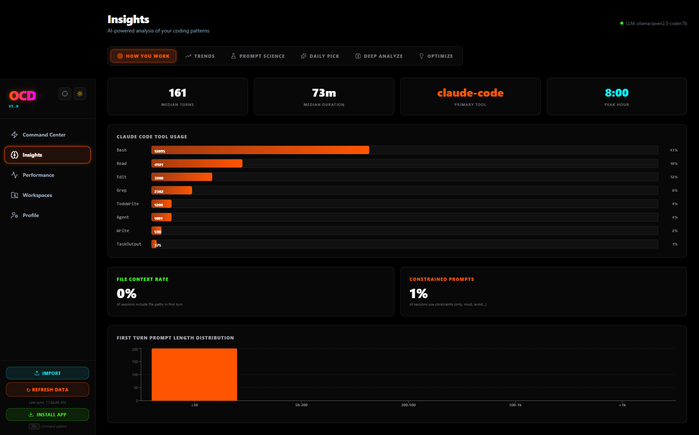
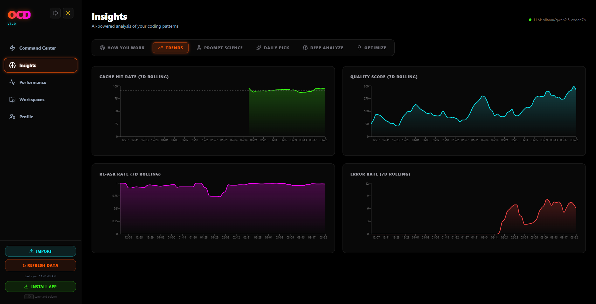
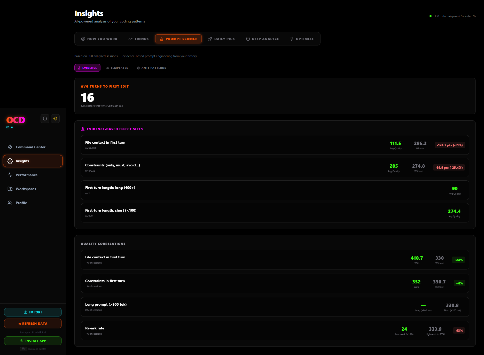
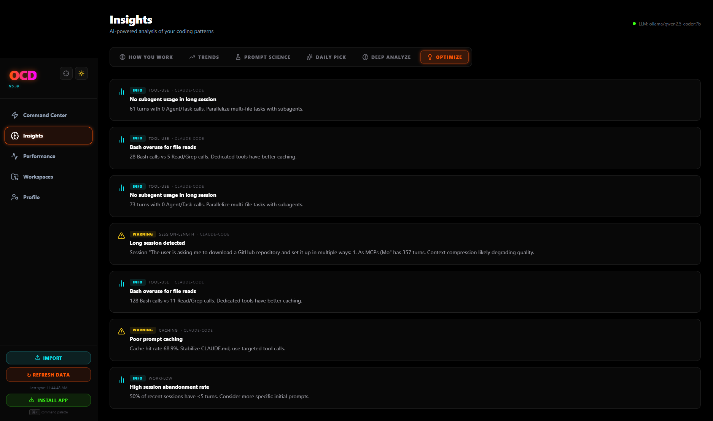

# OCD — Omni Coder Dashboard v5.3.0

### The open-source AI memory engine for coding tools

> A self-building brain across all your AI coding tools. Real semantic embeddings out of the box, 18 MCP tools, cross-tool routing, prompt science, proactive IDE interception, and a Memory dashboard — all 100% local, zero API keys required.

[](https://www.npmjs.com/package/omni-coder-dashboard)
[](https://nodejs.org)
[](LICENSE)
[](#what-gets-tracked)
[](#mcp-setup-30-seconds-no-api-key)
[](docker-compose.yml)
[](https://github.com/Riko5652/OCD)

<p align="center">
  
</p>

---

## What's New in v5.3.0

> **True semantic memory out of the box** — no Ollama, no API keys, no config.

- **Real Local Embeddings** — Ships `all-MiniLM-L6-v2` via ONNX runtime (`@xenova/transformers`). Every session gets 384-dimensional semantic vectors automatically. The hash-based fallback is now a last resort, not the default. Your "semantic memory" is actually semantic now.
- **Memory Dashboard** — New "Memory" tab in Insights showing: active embedding provider, coverage %, provider breakdown, quality labels (semantic vs keyword), and a live similarity search box to test your memory bank.
- **Shell Hook Installer** — `pnpm install-hook` (or `ocd install-hook`) appends a `PROMPT_COMMAND`/`precmd` hook to your `.bashrc`/`.zshrc` that automatically captures terminal errors for proactive IDE interception. No manual log file setup.
- **Match Quality Labels** — MCP search results now say "(semantic match)" or "(keyword match)" so you know whether you're getting real vector similarity or just keyword overlap.
- **P2P Security Transparency** — Dashboard shows a warning banner when P2P sync is active over plaintext HTTP, with guidance to use VPN/Tailscale for sensitive environments.
- **No More 1000-Row Cap** — Similarity search now scans all embeddings, not an arbitrary subset.

<details>
<summary><strong>v5.2.x additions</strong> (click to expand)</summary>

- **Platform Parity** — All adapters (Windsurf, Continue.dev, Copilot, Aider) now match Claude Code's parsing depth: turn-level analysis, code metrics, tool detection, and error tracking across every platform.
- **Single-Tool User Optimization** — The routing engine detects single-tool users and provides model-level recommendations instead of irrelevant cross-tool comparisons.
- **Session Health Check** — `get_session_health_check` MCP tool gives agents cross-session self-awareness with structured `continue/compact/new_session` action signals.
- **Token Efficiency Tips** — Personalized `get_efficiency_tips` MCP tool: burn rate, waste detection, quick wins from your very first session.
- **Prompt Science** — Evidence-based prompt engineering with effect sizes and sample counts mined from your best sessions.
- **Architecture Hardening** — Structured logging (pino), Swagger/OpenAPI docs, route modularization, DB index tuning.

</details>

<details>
<summary><strong>v5.1 additions</strong></summary>

- **Proactive IDE Interception** — Background watcher monitors your terminal for stack traces, finds matching solutions via vector search, and fires OS-level notifications + SSE pushes to your IDE instantly — no prompt needed.
- **Anti-Hallucination Negative Prompt Injector** — Builds an Anti-Pattern Graph from your failing sessions and injects explicit `DO NOT use X` constraints into new prompts via the `get_negative_constraints` MCP tool.
- **Token Arbitrage & Cost Routing** — Classifies every prompt by task type and complexity, routes to local Ollama (free) when your historical success rate is ≥ 92%, and logs estimated savings per request.
- **P2P Secure Team Memory** — Syncs embeddings across teammates on the same LAN or Tailscale using UDP discovery + HMAC-SHA256 authentication. No cloud, no source code shared — embeddings only.

</details>

---

## Usage by Experience Level

Whether you just installed your first AI coding tool or you're orchestrating multi-agent pipelines, OCD meets you where you are.

### Beginner — "I just started using AI coding tools"

```bash
npx omni-coder-dashboard                    # 1. Launch — zero config, auto-detects your tools
```

- **What you get on day one:** A visual dashboard showing every session across all your AI tools, how many tokens you used, and which sessions succeeded vs. failed.
- **Start here:** Open the **Command Center** tab — it shows your daily activity, top tools, and a savings estimate.
- **Key MCP tools to try:**
  - `get_efficiency_tips` — personalized tips to reduce token waste, even with one session of data
  - `get_routing_recommendation` — asks "which tool + model should I use for this task?" and answers with your own data
- **Tip:** Just use your AI tools normally. OCD watches in the background and builds your personal knowledge base automatically.

### Intermediate — "I use multiple AI tools and want to optimize"

```bash
npx omni-coder-dashboard --setup-mcp        # Auto-configure MCP for Claude Code, Cursor, Windsurf
```

- **Unlock cross-tool intelligence:** OCD tracks sessions across all 7 supported tools. The **Performance** tab lets you compare win rates, token costs, and resolution speed per tool and model.
- **Semantic memory kicks in:** After ~20 quality sessions, `get_similar_solutions` starts returning proven fixes from your own history. You'll see solutions from Claude Code surfaced in Cursor, and vice versa.
- **Key MCP tools to add:**
  - `get_similar_solutions` — vector search across all your past sessions
  - `get_optimal_prompt_structure` — evidence-based prompt patterns mined from your best sessions, with effect sizes
  - `get_session_health_check` — periodic health signals so your agent knows when to compact or start fresh
  - `get_negative_constraints` — auto-injects "DO NOT" clauses from your failure history
- **Tip:** Check the **Insights → Prompt Science** tab weekly. It surfaces which prompt structures, lengths, and patterns correlate with higher quality in your sessions.

### Advanced — "I want full agent orchestration and team workflows"

```bash
# Semantic embeddings work out of the box — no config needed
npx omni-coder-dashboard

# Upgrade to Ollama for 768-dim embeddings + LLM features
OLLAMA_HOST=http://localhost:11434 npx omni-coder-dashboard

# Auto-install shell hook for proactive IDE interception
ocd install-hook

# Enable P2P team memory (LAN or Tailscale)
P2P_SECRET=your-team-key npx omni-coder-dashboard

# Docker for always-on deployment
docker compose up -d
```

- **Agent-grade MCP integration:** All 18 MCP tools are designed for autonomous agent consumption — structured JSON responses, confidence scores, and action signals (`continue/compact/new_session`).
- **Token arbitrage:** Route prompts to local Ollama when your historical success rate is high enough, saving API costs automatically. Full audit trail via `get_arbitrage_recommendation`.
- **P2P team memory:** Share embeddings (never source code) across your team with HMAC-SHA256 authentication. Query teammate solutions with `get_team_memory`. Dashboard shows security warnings when running over plaintext HTTP.
- **Proactive IDE interception:** Run `ocd install-hook` to auto-configure your shell. Errors are captured to `~/.ocd/terminal.log` and matched against your vector store in real time. Solutions are pushed via OS notifications + SSE before you open a new prompt.
- **Production deployment:**
  - Swagger/OpenAPI docs at `/docs` for REST API integration
  - Structured JSON logging (pino) for log aggregation pipelines
  - `AUTH_TOKEN` env var for shared/CI environments
  - Webhook + API endpoints for CI/CD session ingestion
- **Key MCP tools for agents:**
  - `get_session_health_check` — cross-session self-awareness for long-running agents
  - `get_knowledge_context` — graph neighborhood traversal for deep context injection
  - `push_handoff_note` — cross-tool context bridge when switching between agents
  - `get_attribution_report` — AI vs. human authorship tracking for engineering managers

---

## Screenshots

### Command Center
> Cross-tool KPIs, token burn rate, quick wins, daily activity, and sessions by tool — all in one view.

<p align="center">
  
</p>

<details>
<summary><strong>Insights — AI-powered analysis of your coding patterns</strong> (click to expand)</summary>

#### How You Work
> Median turns, session duration, primary tool, tool usage breakdown, file context rate, and prompt length distribution.

<p align="center">
  
</p>

#### Trends (7-Day Rolling)
> Cache hit rate, quality score, re-ask rate, and error rate tracked over time with rolling averages.

<p align="center">
  
</p>

#### Prompt Science
> Evidence-based prompt engineering: effect sizes, quality correlations, and anti-patterns mined from your best sessions.

<p align="center">
  
</p>

#### Optimize
> AI-powered recommendations: subagent usage, bash overuse detection, long session warnings, caching insights, and workflow tips.

<p align="center">
  
</p>

</details>

---

## What it actively does for you

This is not a passive analytics dashboard. It's a system that makes you faster — and helps you do more within your usage caps:

**Token Budget Tracker** — Real-time burn rate monitoring: today's usage, 7-day average, weekly cost forecast, and efficiency-per-tool ranking (tokens per quality point). Works with any single tool from day one.

**Semantic Memory** — When Claude Code solves a complex migration in 15 turns, the system vectorizes the solution using a local ONNX neural model (all-MiniLM-L6-v2, 384 dimensions). Two weeks later, when you hit a similar error in Cursor, the MCP server finds the proven solution via real cosine similarity — not keyword matching — and injects it into your prompt context. Zero API keys, zero config, real semantic understanding out of the box.

**Routing Recommendations** — "For postgres migrations, use Claude Code + claude-sonnet-4-6 (resolves in 4 turns, 87% win rate). Cursor + gpt-4o takes 11 turns." Based on your actual session history, not benchmarks.

**Real-time Coaching** — SSE-pushed nudges every 60 seconds: alerts when sessions run too long, cache hit rate drops, error spikes occur, or you're idle. Dismissible, actionable, and based on your patterns.

**Prompt Science** — Evidence-based prompt engineering grounded in your session history. Mines your best sessions (quality > 75) to discover patterns that improve quality, reduce turns, and optimize cache hits. Every recommendation includes effect sizes and sample counts so you know exactly what works — and by how much.

**Savings Report** — Concrete metrics on what the system saves you: cache hit savings ($), turns saved vs baseline, time estimates. Toggle between relative metrics and dollar estimates.

**Proactive IDE Interception** — Watches your terminal for stack traces in the background. Run `ocd install-hook` to auto-configure your shell — errors are captured automatically. When a stack trace appears, the system queries your vector store and pushes a matched solution to your IDE via OS notification and SSE — before you even open a new prompt.

**Anti-Hallucination Guard**  — Mines your failing sessions to build an Anti-Pattern Graph. The `get_negative_constraints` MCP tool injects `DO NOT use X` clauses at the start of any session, eliminating locally-known failure patterns.

**Token Arbitrage**  — Every prompt is classified by task type and routed to the cheapest viable model. When your local Ollama has a ≥ 92% win rate on a task type, it proxies there for free. Full audit log with per-request savings estimates.

**P2P Team Memory**  — Shares embeddings (never source code) with teammates over UDP + HMAC-SHA256. Works on LAN or Tailscale. Query peer solutions with `get_team_memory` — a shared brain with zero cloud dependency.

**AI Attribution Reporting** — Every commit is scored with an `ai_percentage` (0–100%) tracking how much code was AI-assisted vs. human-authored. Query per-project, per-branch, or per-timeframe via the `get_attribution_report` MCP tool or REST API. Built for engineering managers who need velocity tracking, code review prep, and impact reporting.

---

## Compliance & Data Governance

OCD is built for teams that care about data residency, auditability, and security:

- **100% local-first** — All data lives on your machine in SQLite. Nothing is transmitted unless you explicitly configure a cloud LLM provider.
- **Read-only adapters** — OCD never writes to your AI tools' files. Architectural guarantee, not a config option.
- **Zero telemetry** — No analytics, no tracking, no phone-home. Verified by source audit.
- **Audit logging** — Token arbitrage decisions, IDE interceptions, and P2P sync events are logged with timestamps for regulatory review.
- **AI attribution tracking** — Every commit scored with AI vs. human authorship percentage. Exportable for compliance reporting.
- **Authenticated P2P** — Team memory sharing uses HMAC-SHA256 authentication. Embeddings only — source code is never transmitted. Dashboard displays a security warning when P2P runs over plaintext HTTP.
- **Local-only ONNX model** — Semantic embeddings run entirely in-process via ONNX runtime. Model weights are cached locally (~30MB). No data leaves your machine for embedding generation.
- **Prompt injection protection** — All session text is sanitized before storage and display. CSP headers enforced on the dashboard.
- **Authentication support** — Optional `AUTH_TOKEN` environment variable for shared/CI environments.
- **AGPL-3.0** — Full source available for security audit. Commercial licensing available for enterprises requiring proprietary deployment.

See [PRIVACY.md](PRIVACY.md) for the full data handling policy.

---

## MCP Setup (30 seconds, no API key)

The dashboard exposes an MCP server with **18 tools** that any AI agent can call mid-session. Zero API keys needed.

```bash
# Auto-setup for all detected MCP clients
npx omni-coder-dashboard --setup-mcp

# Or add to a specific project
npx omni-coder-dashboard --setup-mcp --project
```

This writes the correct config to Claude Code, Cursor, and Windsurf automatically. Or manually add to your `.mcp.json`:

```json
{
  "mcpServers": {
    "ai-brain": {
      "command": "npx",
      "args": ["ocd", "--mcp"]
    }
  }
}
```

**Available MCP tools:**

| Tool | What it does |
|------|-------------|
| `get_similar_solutions` | **Find proven solutions** from past sessions matching your current error or task context |
| `get_knowledge_context` | **Inject relevant context** — returns the knowledge graph neighborhood for your current work |
| `get_last_session_context` | Pick up where a different tool left off |
| `get_routing_recommendation` | Which tool + model to use for this task |
| `get_efficiency_snapshot` | Cache hit rate, first-attempt %, error recovery |
| `get_active_recommendations` | Open optimization nudges |
| `get_project_stats` | Token/session/model breakdown for a project |
| `get_model_comparison` | claude-sonnet vs gpt-4o vs gemini on your actual sessions |
| `push_handoff_note` | Save a note before switching tools |
| `get_optimal_prompt_structure` | **Evidence-based prompt science** — patterns with effect sizes and confidence levels from your best sessions |
| **`get_attribution_report`** | **NEW — AI vs. human authorship breakdown per project/branch/timeframe** |
| **`get_efficiency_tips`** | **NEW — personalized token-saving tips: burn rate, quick wins, waste detection** |
| `get_topic_summary` | Executive summary of work on a topic within a project |
| **`get_negative_constraints`** | **NEW — inject "DO NOT use X" clauses derived from your local failure history** |
| **`get_arbitrage_recommendation`** | **NEW — local vs cloud routing recommendation with estimated savings** |
| **`get_team_memory`** | **NEW — search peer-synced embeddings for solutions from your teammates** |
| **`submit_ide_trace`** | **NEW — manually submit a stack trace for instant proactive analysis** |
| **`get_session_health_check`** | **NEW — cross-session health signals: status, suggested action, quality baselines, nudges** |

---

## Import online sessions

Not everything lives in local files. Import sessions from web-based AI tools:

**Bookmarklet** — One-click capture from ChatGPT, Claude.ai, or Gemini. Visit `http://localhost:3030/api/bookmarklet` for setup instructions.

**API Upload** — `POST /api/sessions/upload` accepts JSON arrays of session data for bulk import.

**Webhook** — Push session data from CI/CD or automation:
```bash
curl -X POST http://localhost:3030/api/webhook/session \
  -H "Content-Type: application/json" \
  -d '{"tool":"chatgpt","title":"Debug API","turns":[{"role":"user","content":"..."}]}'
```

**API** — `POST /api/sessions/import` accepts the [import schema](http://localhost:3030/api/sessions/import/schema).

---

## Quick start

```bash
# No install — just run (zero config)
npx omni-coder-dashboard

# Or install globally
npm install -g omni-coder-dashboard
ocd

# Clone and run (development)
git clone https://github.com/Riko5652/OCD
cd OCD
pnpm install
pnpm run build
pnpm run start

# Docker
docker compose up

# GitHub Codespaces — one-click dev environment
# Click "Code" → "Codespaces" → "Create codespace on main"
```

Open **http://localhost:3030**. The terminal shows a discovery report: which tools were found, which weren't, and exact paths for anything missing.

**Zero config required.** All tool data paths are auto-detected. See [SETUP.md](SETUP.md) for overrides.

---

## What gets tracked

All data is read-only. Nothing is ever written to your AI tools' files.

| Tool | How |
|------|-----|
| **Claude Code** | Reads `~/.claude/projects/*/` JSONL session files |
| **Cursor** | Reads local SQLite DB (chat history, composer sessions, code authorship stats) |
| **Aider** | Reads `.aider.chat.history.md` files in your project directories |
| **Windsurf** | Reads Codeium's local SQLite DB (chat sessions, token counts) |
| **GitHub Copilot** | Reads VS Code extension telemetry + Copilot Chat conversation history |
| **Continue.dev** | Reads `~/.continue/sessions/*.json` |
| **Gemini/Antigravity** | Reads `~/.gemini/antigravity/` session logs |

---

## Semantic Memory Engine

The dashboard doesn't just track sessions — it learns from them.

**Vector Embeddings** — Every high-quality session (quality > 50) is vectorized using a 4-tier provider cascade:

| Priority | Provider | Dimensions | Quality | Setup |
|----------|----------|-----------|---------|-------|
| 1 | **Local ONNX** (all-MiniLM-L6-v2) | 384 | Real semantic | Zero config (auto-downloads ~30MB on first run) |
| 2 | **Ollama** (nomic-embed-text) | 768 | Real semantic | Requires local Ollama server |
| 3 | **OpenAI** (text-embedding-3-small) | 1536 | Real semantic | Requires API key |
| 4 | **Hash fallback** | 512 | Keyword only | Automatic (last resort) |

The local ONNX model is the default — real 384-dimensional semantic embeddings with zero configuration. No API keys, no external services, no Docker. It just works.

**Knowledge Graph** — An in-memory graph connects sessions through shared files, projects, error patterns, tool chains, and task types. When you ask "what solved this before?", the system traverses the graph to find related solutions across all tools.

**Memory Dashboard** — The Insights → Memory tab shows your embedding status at a glance: active provider, coverage percentage, provider breakdown, and a live similarity search box to test queries against your memory bank. Search results are labeled "semantic" or "keyword" so you always know what quality you're getting.

**How it helps mid-session:**
1. You hit an error in Cursor
2. The MCP tool `get_similar_solutions` fires
3. The system finds that Claude Code resolved a similar error last week (semantic match, 87% similarity)
4. It injects the proven solution, context, and approach into your current prompt

---

## Dashboard navigation

### 5-pillar layout

**Command Center** — KPI cards, daily activity, savings report, CI/CD optimization insights. Collapsible sections to reduce cognitive load.

**Insights** — AI-powered analysis with 7 sub-tabs: How You Work, Trends, Prompt Science, Daily Pick, Deep Analyze, Optimize, Memory.

**Performance** — 9 tabbed views: Tool Comparison, Model Usage, Model Performance, Win Rates, Routing, Cost Tracking, Code Generation, Code Authorship, Agentic Scores.

**Workspaces** — Per-project rollup: tokens, lines added, dominant tool/model, drill-down.

**Profile** — Gamified: level, XP, streak, achievements, activity heatmap, flow state.

**Focus Mode** — App-level toggle that reduces each page to its most actionable KPIs + single recommendation. Toggle via sidebar button.

---

## Privacy

- **All data stays on your machine.** Nothing is sent anywhere unless you configure an LLM provider for optional Deep Analyze.
- **Server binds to 127.0.0.1 by default.**
- **Read-only access** to all AI tool databases.
- **Prompt injection protection** — all session text is sanitized.
- **No telemetry. No analytics. No tracking.**

See [PRIVACY.md](PRIVACY.md) for the full policy.

---

## Monetization model

**Free forever (local-first, open source):**
- All adapters, analytics, MCP server, coaching, routing
- Semantic memory (vector search, knowledge graph, solution injection)
- Session import (paste, upload, bookmarklet, webhook)
- Savings report, prompt coaching, all single-user features

**Paid (future — cloud/team tier):**
- Cloud sync between machines (encrypted, anonymized)
- Team aggregation and cross-regional benchmarking
- Enterprise SSO/RBAC, audit logs
- PM tool integrations (Jira, Linear, GitHub Issues)
- Velocity correlation dashboards

---

## LLM provider (optional)

The core dashboard — including real semantic embeddings — works without any LLM or API key. Optional providers are used for: Deep Analyze, Daily Pick, Topic Summaries, and higher-dimensional embeddings.

**Embeddings require zero config.** The built-in ONNX model (all-MiniLM-L6-v2) provides 384-dim semantic vectors out of the box. Ollama/OpenAI give higher dimensionality if you want it, but are not required.

```env
# Free, local — recommended for LLM features (embeddings already work without this)
OLLAMA_HOST=http://localhost:11434
OLLAMA_MODEL=gemma2:2b

# Cloud (any one — tried in this order)
GEMINI_API_KEY=...              # Google Gemini (cascades models automatically)
AZURE_OPENAI_API_KEY=...        # Azure OpenAI
OPENAI_API_KEY=sk-...           # OpenAI
ANTHROPIC_API_KEY=sk-ant-...    # Anthropic Claude
```

---

## Architecture

```
┌─────────────────────────────────────────────────────────┐
│                    Browser (localhost:3030)              │
│  ┌──────────┐ ┌──────────┐ ┌──────────┐ ┌───────────┐  │
│  │ Command  │ │Workspaces│ │  Perf &  │ │  Profile   │  │
│  │ Center   │ │& Projects│ │  Costs   │ │& Gamify    │  │
│  └────┬─────┘ └────┬─────┘ └────┬─────┘ └─────┬─────┘  │
│       └─────────────┴────────────┴─────────────┘        │
│                   Recharts · SSE · Tailwind               │
└───────────────────────┬─────────────────────────────────┘
                        │ REST + SSE
┌───────────────────────▼─────────────────────────────────┐
│                  Fastify API Server                       │
│                                                          │
│  ┌─────────────┐  ┌──────────────┐  ┌────────────────┐  │
│  │  7 Adapters │  │   Analytics  │  │  Intelligence  │  │
│  │ Claude Code │  │  Overview    │  │  Engines       │  │
│  │ Cursor      │  │  Tool Compare│  │  ┌───────────┐ │  │
│  │ Aider       │  │  Cost Calc   │  │  │ Semantic  │ │  │
│  │ Windsurf    │  │  Code Gen    │  │  │ Memory    │ │  │
│  │ Copilot     │  │  Insights    │  │  │ (Vectors) │ │  │
│  │ Continue    │  │  Trends      │  │  ├───────────┤ │  │
│  │ Gemini      │  └──────────────┘  │  │ Knowledge │ │  │
│  └──────┬──────┘                    │  │ Graph     │ │  │
│         │ read-only                 │  ├───────────┤ │  │
│         ▼                           │  │ Router    │ │  │
│  ┌─────────────┐                    │  │ (win-rate)│ │  │
│  │ Local files │                    │  ├───────────┤ │  │
│  │ ~/.claude/  │                    │  │ Session   │ │  │
│  │ Cursor DB   │                    │  │ Coach     │ │  │
│  │ .aider/     │                    │  │ (SSE)     │ │  │
│  │ etc.        │                    │  └───────────┘ │  │
│  └─────────────┘                    └────────────────┘  │
│                                                          │
│  ┌──────────────────────────────────────────────────┐   │
│  │           SQLite (better-sqlite3, in-process)     │   │
│  │  sessions · turns · stats · vectors · daily_stats │   │
│  └──────────────────────────────────────────────────┘   │
└───────────────────────┬─────────────────────────────────┘
                        │ stdio
┌───────────────────────▼─────────────────────────────────┐
│                   MCP Server (18 tools)                  │
│                                                          │
│  get_similar_solutions    →  vector search + graph walk  │
│  get_knowledge_context    →  graph neighborhood          │
│  get_routing_recommendation → tool+model win-rate lookup │
│  get_optimal_prompt_structure → prompt pattern extraction │
│  push_handoff_note        →  cross-tool context bridge   │
│  ... 6 more                                              │
│                                                          │
│  Called by: Claude Code · Cursor · Windsurf · any MCP    │
└─────────────────────────────────────────────────────────┘

Data flow:
  1. Adapters read local session files (read-only, no writes)
  2. Sessions scored, classified, and stored in SQLite
  3. High-quality sessions vectorized (local ONNX → Ollama → OpenAI → hash)
  4. Knowledge graph links sessions by files, errors, tools, projects
  5. MCP tools query vectors + graph to inject context mid-session
  6. Dashboard renders analytics via REST; coach pushes SSE nudges
  7. Shell hook captures terminal errors → IDE interceptor matches solutions
```

**Key design decisions:**
- **Zero external dependencies for core** — no Redis, no Postgres, no cloud. SQLite via better-sqlite3 runs in-process.
- **Read-only adapters** — the dashboard never writes to your AI tools' files. It only reads.
- **Real semantic embeddings by default** — ships `all-MiniLM-L6-v2` via ONNX runtime. The hash fallback is a last resort, not the default. No API keys needed for semantic search.
- **MCP over stdio** — no HTTP server for MCP. Uses the standard Model Context Protocol stdio transport, so any MCP-compatible client can connect.
- **TypeScript monorepo** — pnpm workspace with separate server (Fastify) and client (React + Vite) apps.

---

## Tech

- **Node.js 18+ ESM** — TypeScript monorepo with pnpm workspaces
- **Fastify 5** — API server with SSE, Swagger/OpenAPI docs at `/docs`
- **React 18 + Vite** — client dashboard with Tailwind CSS + Recharts
- **SQLite (better-sqlite3)** — local database + vector storage
- **@xenova/transformers** — local ONNX runtime for real semantic embeddings (all-MiniLM-L6-v2)
- **In-memory knowledge graph** — session relationship traversal
- **@modelcontextprotocol/sdk** — MCP stdio server
- **File watchers** — live updates when AI tool data changes

---

## Project structure

```
apps/
  server/src/
    adapters/        # One file per AI tool (claude-code, cursor, aider, ...)
    engine/          # Analytics + intelligence engines
      cross-tool-router.ts   # Task classification + win-rate routing
      savings-report.ts      # Cost/time savings calculations
      agentic-scorer.ts      # Autonomy scoring
      session-coach.ts       # Real-time SSE nudges
      prompt-coach.ts        # Prompt patterns from best sessions
      topic-segmenter.ts     # Topic detection + project relevance
      watcher.ts             # File system watchers for live updates
      ide-interceptor.ts     # NEW — terminal watcher + proactive IDE notifications
      anti-pattern-graph.ts  # NEW — failure mining + negative constraint injection
      token-arbiter.ts       # NEW — cost routing proxy + Ollama arbitrage log
      p2p-sync.ts            # NEW — UDP peer discovery + HMAC-authenticated embedding sync
    lib/
      vector-store.ts  # Embedding cascade: local ONNX → Ollama → OpenAI → hash
      knowledge-graph.ts # In-memory session relationship graph
      bookmarklet.ts   # Browser capture for ChatGPT/Claude/Gemini
    db/
      index.ts         # Database initialization
      schema.ts        # SQLite schema + migration
    mcp-handoff.ts   # MCP Universal Brain server (18 tools)
    token-budget.ts  # Daily burn rate, weekly forecast, per-tool efficiency
    index.ts         # Fastify app + all API routes
    config.ts        # Auto-detected paths + discovery report
  client/src/        # React + Vite dashboard UI
    pages/           # CommandCenter, Performance, Workspaces, Profile, Insights (incl. Memory tab)
bin/
  ai-dashboard.js  # CLI entrypoint
  setup-mcp.js     # MCP auto-setup for Claude Code / Cursor / Windsurf
  install-hook.js  # Shell hook installer for proactive IDE interception
  doctor.mjs       # Health check
```

---

## Adding a new AI tool

1. Create `apps/server/src/adapters/your-tool.ts` implementing `IAiAdapter`
2. Register it in `apps/server/src/index.ts` with `registry.register(new YourAdapter())`
3. The tool will be auto-seeded in the database on startup

---

## Roadmap

- [x] Semantic memory engine (vector embeddings + knowledge graph)
- [x] Session import (bookmarklet, paste, webhook)
- [x] MCP zero-config setup (`--setup-mcp`)
- [x] Savings report
- [x] Real-time coaching via SSE
- [x] Prompt optimization analysis
- [x] v5 TypeScript refactor (Fastify + React + pnpm monorepo)
- [x] **Proactive IDE interception** (terminal watcher + OS notifications + SSE push)
- [x] **Anti-hallucination negative prompt injector** (Anti-Pattern Graph + MCP tool)
- [x] **Token arbitrage & cost routing** (Ollama proxy + per-request savings log)
- [x] **P2P secure team memory** (UDP discovery + HMAC-SHA256 embedding sync)
- [x] **Session health check** (cross-session quality baselines + structured action signals)
- [x] **Token efficiency tips** (burn rate, quick wins, waste detection)
- [x] **Real local semantic embeddings** (ONNX all-MiniLM-L6-v2, zero config)
- [x] **Memory dashboard** (provider status, coverage, live similarity search)
- [x] **Shell hook installer** (auto-capture terminal errors for IDE interception)
- [x] **Match quality transparency** (semantic vs keyword labels in search results)
- [ ] Enterprise: secure team sync with anonymized aggregation
- [ ] PM integration: Jira/Linear/GitHub Issues velocity correlation
- [ ] Cross-regional benchmarking

---

## License

AGPL-3.0-or-later — see [LICENSE](LICENSE). For commercial licensing, see [LICENSE-COMMERCIAL.md](LICENSE-COMMERCIAL.md).

Built and maintained by [Dor Lipetz](https://github.com/Riko5652).
