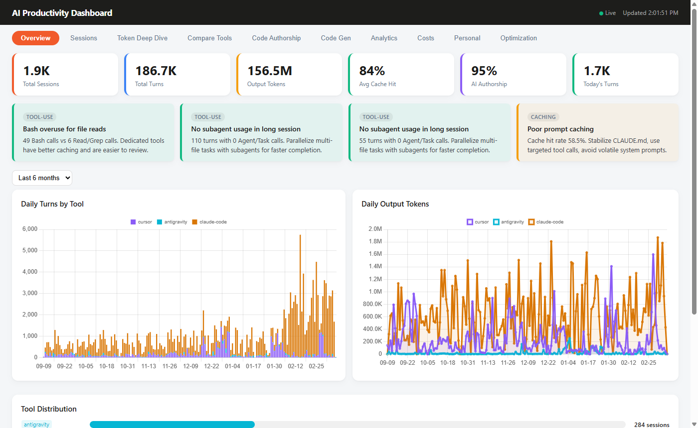
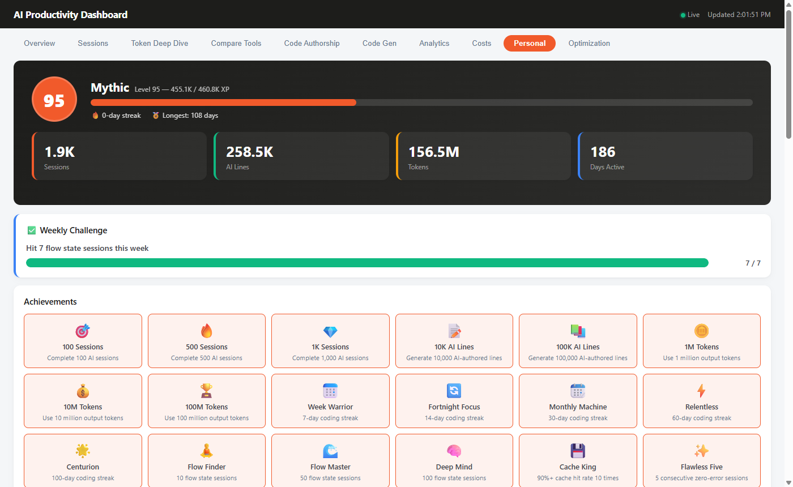
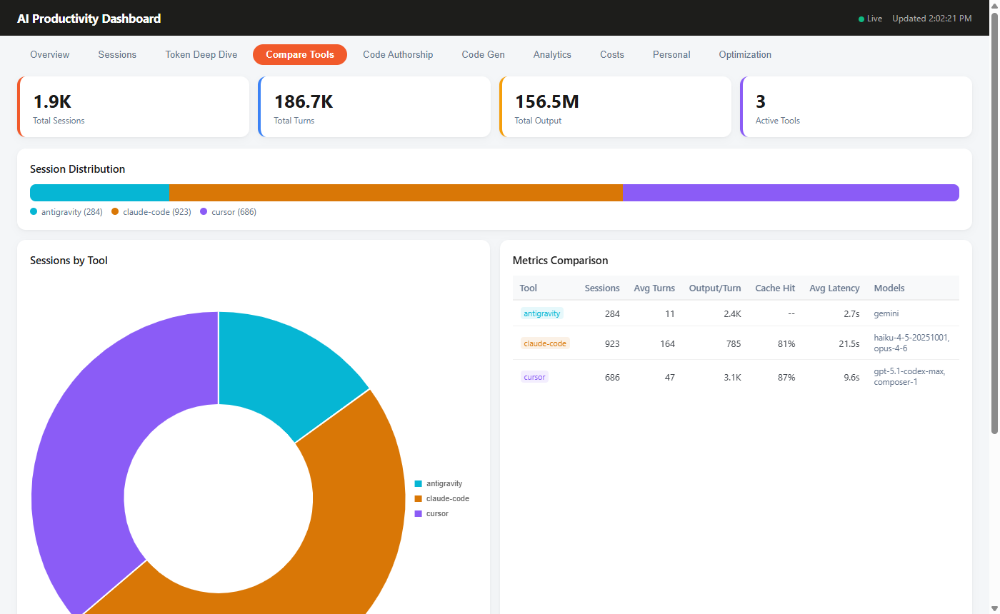
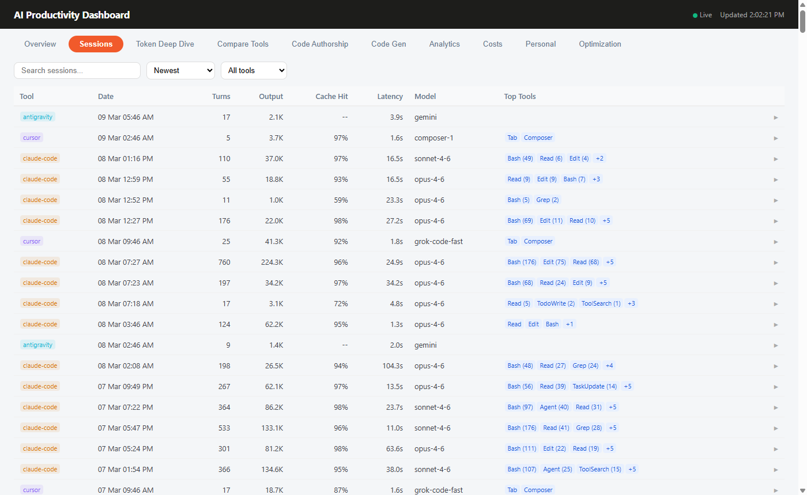

# AI Productivity Dashboard

> A local-first tool that tracks your AI coding sessions, benchmarks every tool and model against each other, and tells you which one actually works best for the work you do.

[](https://nodejs.org)
[](LICENSE)
[](#what-gets-tracked)
[](SETUP.md#mcp-server-setup)
[](docker-compose.yml)
[](https://www.npmjs.com/package/ai-productivity-dashboard)

---

## What it does

When you switch between Claude Code, Cursor, Aider, Windsurf, or Copilot every day, you're building up a huge amount of data about what actually works — but most of it just disappears. This dashboard reads your local session data, stores it in a local SQLite database, and gives you a clear picture of patterns you can act on.

It's not meant to replace any tool. It's meant to help you use all of them better.

**Some things it can tell you:**
- "For postgres migrations, Claude Code with claude-sonnet-4-6 resolves them in 4 turns on average. Cursor with gpt-4o takes 11."
- "Your cache hit rate dropped 20% this week — here's why."
- "This session touched 12 files in 8 turns. That's your most agentic session this month."
- "3 sessions in pm-dashboard/ were about writing blog posts, not code. They've been flagged so they don't skew your project metrics."

It also runs an MCP server so any AI agent (Claude Code, Cursor, Aider) can query your live stats mid-session: which tool should I use for this task, what were you working on last, how efficient have you been this week.

---

## Screenshots

| Overview | Personal Insights |
|----------|------------------|
|  |  |

| Compare Tools | Session History |
|--------------|----------------|
|  |  |

---

## Quick start

```bash
# No install — just run (zero config)
npx ai-productivity-dashboard

# Or install globally
npm install -g ai-productivity-dashboard
ai-dashboard

# Clone and run
git clone https://github.com/Riko5652/ai-productivity-dashboard
cd ai-productivity-dashboard
npm install
npm start              # .env is auto-created from .env.example on first run

# Docker
git clone https://github.com/Riko5652/ai-productivity-dashboard
cd ai-productivity-dashboard
docker compose up
```

Open **http://localhost:3030**. The first thing you'll see in the terminal is a discovery report showing which tools were found and which weren't — with exact paths and hints for anything missing.

**Zero config required.** All tool data paths are auto-detected. See [SETUP.md](SETUP.md) for overrides.

---

## What gets tracked

All data is read-only. Nothing is ever written to your AI tools' files.

| Tool | How |
|------|-----|
| **Claude Code** | Reads `~/.claude/projects/*/` JSONL session files |
| **Cursor** | Reads local SQLite DB (chat history, code authorship stats) |
| **Aider** | Reads `.aider.chat.history.md` files in your project directories |
| **Windsurf** | Reads Codeium's local SQLite DB (chat sessions, token counts) |
| **GitHub Copilot** | Reads VS Code extension telemetry (suggestion acceptance by model) |
| **Continue.dev** | Reads `~/.continue/sessions/*.json` |
| **Gemini/Antigravity** | Reads `~/.gemini/antigravity/` session logs |

---

## Dashboard tabs

**Overview** — KPIs at a glance: sessions, turns, output tokens, cache hit rate, AI code authorship, today's activity. Daily charts by tool.

**Sessions** — Searchable/sortable table of every session. Expand any row to see per-turn details.

**Token Deep Dive** — Where your tokens actually go. Breakdown by input/cache/output with per-session mix chart.

**Compare Tools** — Side-by-side: which tool you use most, where each one performs differently, distribution across time.

**Code Authorship** — What percentage of your committed code was AI-generated. Scored per commit, trended over time.

**Code Gen** — First-attempt success rate, error rate trend, thinking depth, lines added. Model quality comparison table.

**Analytics** — Model usage distribution, turns per day, efficiency trend (O × Q × S score).

**Costs** — Estimated spend by tool and model. Cost per session. Trend charts.

**Personal** — Gamified: level, XP, streak, achievements. Activity heatmap. Flow state trend. Personal records.

**Optimization** — Open recommendations sorted by severity. One-click dismiss.

**Insights** — How you work: prompt length distribution, tool call breakdown, cache/quality/error trends. Daily automation pick from your own patterns. Deep Analyze (LLM-powered, optional).

**Projects** — Per-project rollup: total tokens, lines added, dominant tool and model, tool breakdown. Click any project to drill into per-tool+model performance and AI suggestions.

**Models** — Cross-tool model comparison: avg turns, cache hit %, latency, error rate. Win-rate matrix by task type. Interactive routing recommendation: describe a task, get a data-driven suggestion.

---

## MCP Universal Brain

The dashboard runs an MCP stdio server exposing 9 tools that any AI agent can call.

Register it with Claude Code by adding to `.mcp.json` in your project:

```json
{
  "mcpServers": {
    "ai-brain": {
      "command": "npx",
      "args": ["ai-productivity-dashboard", "--mcp"]
    }
  }
}
```

**Available tools:**

| Tool | What it does |
|------|-------------|
| `get_last_session_context` | Pick up where a different tool left off — surfaces last session context so you don't re-explain the problem |
| `get_routing_recommendation` | "Which tool + model should I use for this?" based on your history |
| `get_efficiency_snapshot` | Current week's cache hit rate, first-attempt %, turns, tokens |
| `get_active_recommendations` | Open optimization nudges from the dashboard |
| `get_project_stats` | Token/session/model breakdown for a specific project |
| `get_model_comparison` | claude-sonnet vs gpt-4o vs gemini — on your actual sessions |
| `push_handoff_note` | Save a note before switching tools; next tool picks it up |
| `get_optimal_prompt_structure` | Prompt patterns from your highest-quality sessions by task type |
| `get_topic_summary` | "What db-work was done in pm-dashboard last week?" |

---

## Privacy

- **All data stays on your machine.** Nothing is sent anywhere unless you configure an LLM provider for the optional Deep Analyze feature.
- **Server binds to 127.0.0.1 by default** — not reachable from your network. Set `BIND=0.0.0.0` only if you need LAN access (or use Docker, which sets it automatically).
- **Read-only access** to all AI tool databases. Windsurf and Copilot DBs are opened with `{ readonly: true }`.
- **Prompt injection protection** — all session text is sanitized before being passed to any LLM.
- **No telemetry.** No analytics. No opt-in tracking. The source is short and auditable.

---

## LLM provider (optional)

The core dashboard — all charts, tables, recommendations, MCP tools — works without any LLM. The LLM is only used for:
- Deep Analyze button (Insights tab)
- Daily Automation Pick
- Project AI suggestions (Projects tab drill-down)

Supported providers, in priority order:

```env
# Free, local — recommended
OLLAMA_HOST=http://localhost:11434
OLLAMA_MODEL=gemma2:2b

# Cloud
ANTHROPIC_API_KEY=sk-ant-...
OPENAI_API_KEY=sk-...
AZURE_OPENAI_API_KEY=...
```

---

## Enabling AI Deep Analysis

The **Insights** tab includes on-demand LLM analysis of your usage patterns. Configure one provider:

| Provider | Env vars needed | Cost | Speed |
|----------|----------------|------|-------|
| **Ollama (local, recommended)** | `OLLAMA_HOST=http://localhost:11434` | Free | Fast if running |
| **OpenAI / compatible** | `OPENAI_API_KEY=sk-...` | ~$0.001/analyze | Fast |
| **Anthropic** | `ANTHROPIC_API_KEY=sk-ant-...` | ~$0.001/analyze | Fast |
| **None** | — | Free | Structural analysis only (profile + trends still work) |

Results are cached for 24 hours — the second click is instant. Without any provider, all other Insights features (behavioral profile, trends, prompt signal correlations) work fully with zero external calls.

```bash
# Local Ollama (best for privacy — nothing leaves your machine)
OLLAMA_HOST=http://localhost:11434 npm start

# OpenAI
OPENAI_API_KEY=sk-... npm start

# Anthropic
ANTHROPIC_API_KEY=sk-ant-... npm start

# Override model selection
OLLAMA_MODEL=llama3.2:3b npm start
OPENAI_MODEL=gpt-4o npm start
ANTHROPIC_MODEL=claude-haiku-4-5-20251001 npm start

# Force cache refresh for Deep Analyze
# Append ?refresh=1 to the deep-analyze URL in your browser
```

---

## Tech

- **Node.js 18+ ESM** — no build step, no transpilation
- **Express 4** — minimal API server with SSE live push
- **better-sqlite3** — fast local SQLite, no server process needed
- **Chart.js** (CDN) — all charts rendered in the browser, no bundler
- **@modelcontextprotocol/sdk** — MCP stdio server
- **chokidar** — file watching for live session updates

No React. No Webpack. No TypeScript compilation. Loads in under a second on any hardware made after 2015.

---

## Setup & configuration

See **[SETUP.md](SETUP.md)** for:
- Full installation guide (Windows, macOS, Linux)
- How to tell the dashboard where your tools' data lives
- Path override reference (all env vars)
- MCP registration for Claude Code and Cursor
- Docker setup
- Troubleshooting

---

## Project structure

```
src/
  adapters/        # One file per AI tool (claude-code, cursor, aider, ...)
    registry.js    # Auto-registration — new tools are single-file additions
  engine/          # Analytics engines
    cross-tool-router.js   # Task classification + win-rate routing
    project-insights.js    # Per-project rollup
    agentic-scorer.js      # 0-100 autonomy score per session
    session-coach.js       # Real-time SSE nudges
    prompt-coach.js        # Prompt patterns from high-quality sessions
    topic-segmenter.js     # Detect sessions unrelated to their project
    cross-tool.js          # Tool switch detection + handoff quality
  lib/
    sanitize.js    # Prompt injection protection
  mcp-handoff.js   # MCP Universal Brain server (9 tools)
  server.js        # Express app + all API routes
  db.js            # SQLite schema + migration
  config.js        # Auto-detected paths + startup discovery report
public/            # Static frontend (HTML + vanilla JS, no build step)
bin/
  ai-dashboard.js  # CLI entrypoint (version check, auto-open browser)
```

---

## Adding a new AI tool

1. Create `src/adapters/your-tool.js` with `id`, `name`, and `getSessions()`
2. Call `register(adapter)` at the bottom
3. Import it in `src/server.js`
4. Add a seed row in `src/db.js`

That's it. The adapter registry handles everything else.

---

## Roadmap

These are things that would make it meaningfully better — contributions welcome:

- [ ] GitHub/GitLab PR linking (tie sessions to PRs, show AI % per PR)
- [ ] Devin / OpenHands adapter (REST API polling)
- [ ] PostgreSQL backend + team mode (opt-in, shared leaderboard)
- [ ] Crowd-sourced benchmarks (opt-in, no session content, anonymized)
- [ ] `pkg` binary builds for Windows/macOS/Linux (no Node required)

---

## License

MIT — see [LICENSE](LICENSE). Built and maintained by [Dor Lipetz](https://github.com/Riko5652).

If this is useful to you, a ⭐ on GitHub goes a long way.
